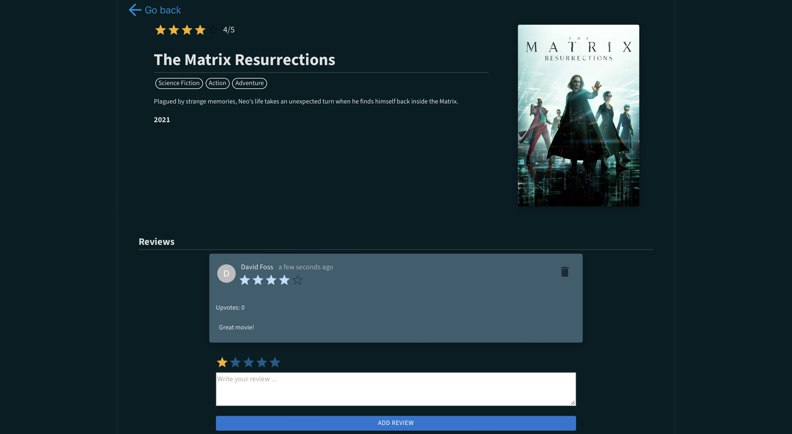
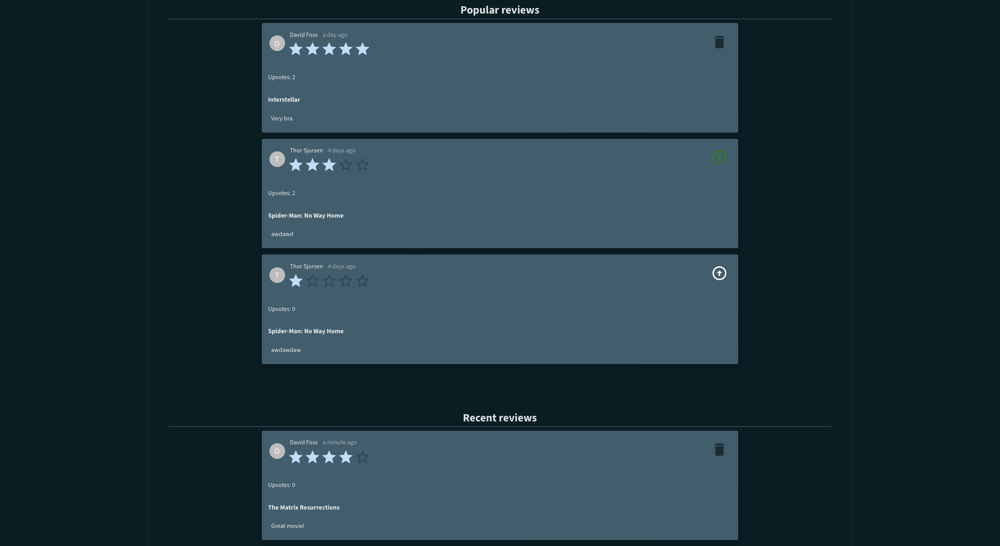

[/nav](./Doc/navigation.md)
/root

# International Review Movie Database (IRMDb)

## Table of contents

- [Description](#description)
- [Visuals](#visuals)
- [Local installation and usage](#local-installation-and-usage)
- [Roadmap](#roadmap)
- [Accessibility and Sustainability](#accessibility-and-sustainability)
- [Linting and formatting](#linting-and-formatting)
- [Authors and acknowledgment](#authors-and-acknowledgment)
- [Project status](#project-status)

## Description

IRMDb is a user-friendly application that helps you discover, review, and rate your favorite movies. With a comprehensive database of movies (**9000+ movies**) from various genres, you can easily search, filter, and sort through a vast collection.

### Main features

- Search for movies by title
- Filter movies by genres
- Sort movies by title, rating, and year
- Pagination, retrieving 12 movies at a time
- View movie details
- Add reviews to movies
- See reviews from other users on movies
- Landing page with popular and recent reviews
- Upvote reviews

## Visuals


The movies page shows results for the filters you have selected



When clicking on a movie, you can see more details about it and add a review



The landing page shows popular and recent reviews

## Local installation and usage

The following instructions will guide you through the process of installing and running the application locally, however you can also access the application at [http://it2810-44.idi.ntnu.no/project2/](http://it2810-44.idi.ntnu.no/project2/) if connected to the NTNU network, either at site or through a VPN.

Clone the repository with

`git clone https://gitlab.stud.idi.ntnu.no/it2810-h23/Team-44/prosjekt-2.git`

<br>

Navigate to the [server](./server/) folder and create a .env.dev file containing the following:

```
  PORT=3001
  DB_PREFIX=mongodb+srv://
  DB_USERNAME=admin
  DB_PASSWORD=admin
  DB_CLUSTER=cluster0.mnvsrky.mongodb.net/?retryWrites=true&w=majority
```

The values here can be changed to your liking, but the .env file must be present for the server to run.

The provided mongoDB cluster is a free tier cluster, and may be slow to respond at times. The application ran in production mode will use a seperate database, which is hosted on a virtual machine at NTNU. This database is faster, but may be unavailable at times.

Then install all dependencies by running

`npm install`

and start the server by running

`npm run start-dev`

<br>

Navigate to [client](./client/) folder and install dependencies by running

`npm install`

and start the client by running

`npm run dev`

<br>

Open your web browser and navigate to [localhost:5173](http://localhost:5173) to access the application

## Roadmap

- Version 2.2
  - Backend (graphql, express, mongoDB)
  - New features
    - Add reviews to movies
    - See reviews from other users on movies
    - Landing page with popular and recent reviews
    - Upvote reviews
  - User experience
    - Increased responsiveness for all devices
    - Web accessibility
- Version 2.3 (**current**)
  - Testing
  - Documentation
  - Security improvements
  - Code quality improvements
  - Error handling improvements

We welcome any suggestions or feature requests from the community.

## Accessibility and Sustainability

### Accessibility (WCAG 2.2 compliance)

Accessibility is discussed in detail in [this](./client/README.md#accessibility-wcag-22-compliance) section of the client README.

### Sustainability

Sustainability is discussed in detail in [this](./server/README.md#sustainability) section of the server README.

In addition, we have a dark design theme that reduces the amount of light emitted by the screen, which is beneficial for the environment.

#### Improvements on Sustainability:

Because of the high load of images on the website, we could have used lazy loading to reduce the amount of data transferred between the client and server. This could have improved sustainability. The browser most often does cache images, but lazy loading would have been more efficient. A dedicated CDN could also have been used to further improve sustainability, however this is not applicable to a project of this size.

Since we do not host the images ourselves, we have no control over the image sizes. We could have used the aforementioned CDN to resize the images to the size we need, which would have reduced the amount of data transferred between the client and server, improving sustainability. An alternative is to use a dedicated image hosting service that provides images in the size and format we need, with a better compression algorithm. These alternatives are not really relevant to a project of this size, however it is worth noting.

## Linting and formatting

To lint the code, run the following command in the respective client and server folders:

`npm run lint`

To check the formatting of the code, run the following command:

`npm run check-format`

To format the code with prettier, run the following command:

`npm run format`

## Authors and acknowledgment

Thor Sjursen

Christian Veiby
Christian Veiby

David Foss

## Project status

Under development
