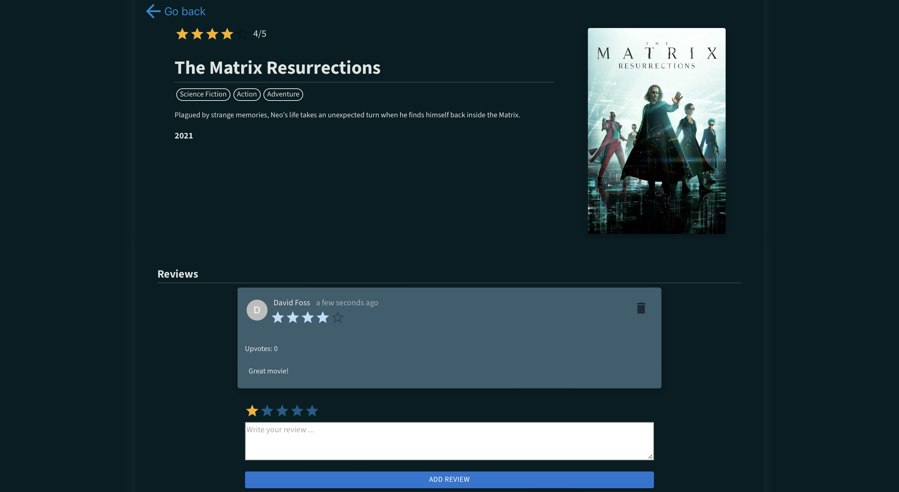
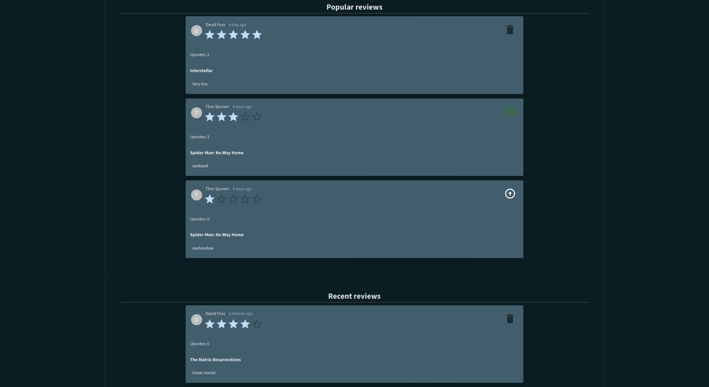

[------------------------nav------------------------](navigation.md)

# International Review Movie Database (IRMDb)

## Description

IRMDb is a user-friendly application that helps you discover, review, and rate your favorite movies. With a comprehensive database of movies from various genres, you can easily search, filter, and sort through a vast collection.

#

## Visuals

The movies page shows results for the filters you have selected

When clicking on a movie, you can see more details about it and add a review

The landing page shows popular and recent reviews

#

## Installation and usage

Clone the repository with

`git clone https://gitlab.stud.idi.ntnu.no/it2810-h23/Team-44/prosjekt-2.git`

#

Navigate to [server](./server/) folder and run

`npm install` to install dependencies

and

`npm start`
to start the server

#

Navigate to [client](./client/) folder and run

`npm install` to install dependencies

and

`npm run dev` to start the client

#

Open your web browser and navigate to [localhost:5173](http://localhost:5173) to access the application

#

## Roadmap

- Version 2.2 (**current**)
  - Backend (graphql, express, mongoDB)
  - New features
    - Add reviews to movies
    - See reviews from other users on movies
    - Landing page with popular and recent reviews
    - Upvote reviews
  - User experience
    - Increased responsiveness for all devices
    - Web accessibility
- Version 2.3 (Future Release)
  - Testing

We welcome any suggestions or feature requests from the community.

#

## Authors and acknowledgment

Thor Sjursen

Chirstian Veiby

David Foss

#

## Project status

Under development
